# ゼロからのロボットアーム入門

**作成者**: 大阪大学 中島優作  
**戻る**: [← シリーズ一覧に戻る](../../index.html)

---

## 本スライドの目標

- この資料はロボットの中でもロボットアームに特化した内容です
- AVRなどの移動ロボットは対象外です
- モノを掴んで運ぶなど簡単な動きを作ることを目的としています

---

## 目的に応じたロボット制御方法

**メーカー制御での動作作成は本スライド、ROSでの動作作成は別スライドで詳しく説明します**

### メーカー提供の動作生成


- ↑モノの移動で十分
- 複雑な動きは必要ない
- **→ このスライドで詳しく説明**

### [ROSによる動作生成](../ros-introduction/index.html)


- ↑複雑な動きが必要
- 様々なメーカーのロボットやセンサを統合したシステムを作りたい
- **→ [別スライド](../ros-introduction/index.html)で詳しく説明**

---

## オススメ参考資料

### 1. 産業用ロボットtheビギニング
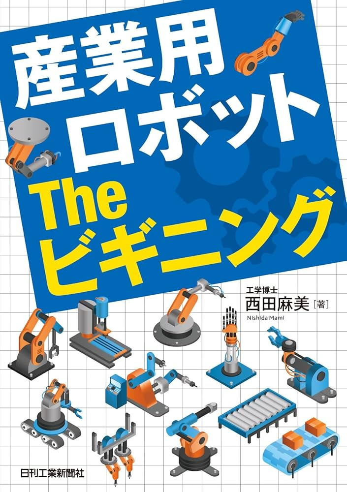
産業用ロボットの基礎的な情報を網羅

### 2. イラストで学ぶロボット工学

ロボットアームの初歩を網羅しつつも、数式もでくるので本格的。  
最も基本の位置制御まで扱っている

---

## ロボット動作の方法

### ティーチングペンダント(TP)
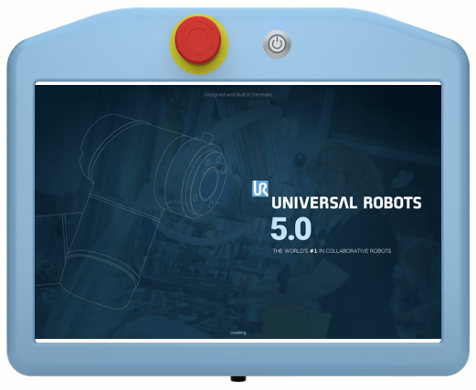
- タブレット端末で操作
- 設定,動作テスト用

### プログラミング

- Python等で動作
- センサ等との統合

---

## プログラムから動かす場合

URはRTDEを使って外部制御が可能で、Ur_rtdeをpipでインストール可能  
例のように、目標の座標とモーションの種類を指定して動作可能

- PTP = moveJ
- LIN = moveL
- CIRC = moveC

```python
import rtde_control
import rtde_receive
import time
robot_ip = "URロボットのIPアドレス" 
rtde_c = rtde_control.RTDEControlInterface(robot_ip)
rtde_r = rtde_receive.RTDEReceiveInterface(robot_ip)
try:
    # PTP動作 (関節空間)
    # 関節角度をラジアンで指定
    target_joints = [0.1, -1.2, 2.3, -1.5, 0.5, 0.0] #ラジアン表記
    rtde_c.moveJ(target_joints, 1.0, 0.5) # 速度1.0rad/s, 加速度0.5rad/s^2
    time.sleep(5)

    # LIN動作 (ベース座標系)
    # ベース座標系での目標TCP位置を指定,  [x, y, z, rx, ry, rz] (単位: [m, rad])
    target_pose_base = [0.3, 0.4, 0.5, 0.0, 0.0, 0.0]
    rtde_c.moveL(target_pose_base, 0.5, 0.3) # 速度0.5m/s, 加速度0.3m/s^2
    time.sleep(5)

    # CIRC動作 (ツール座標系)
    # ツール座標系での中間点と目標点のTCP位置を指定,  [x, y, z, rx, ry, rz] (単位: [m, rad])
    via_pose_tool = [0.1, 0.1, 0.0, 0.0, 0.0, 0.0]
    to_pose_tool = [0.2, 0.0, 0.0, 0.0, 0.0, 0.0]
    rtde_c.moveC(via_pose_tool, to_pose_tool, 0.5, 0.3, pose_tool=True) # 速度0.5m/s, 加速度0.3m/s^2
    time.sleep(5)

finally:
    rtde_r.disconnect()
```

**安全確認してから実行してください**

---

## 動作作成の基本手順


### 動作作成の基本手順
1. **TCPの設定**
2. **座標系の指定**
3. **モーション種類の決定**
4. **実行・テスト**

---

## ステップ①TCP(アームの手先)

TCP = Tool Center Point  
ロボットにとっての手先はどこか

### TCPは乳棒の先端
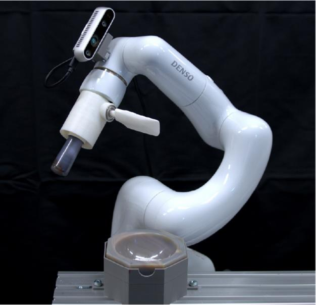

### TCPはグリッパの中央
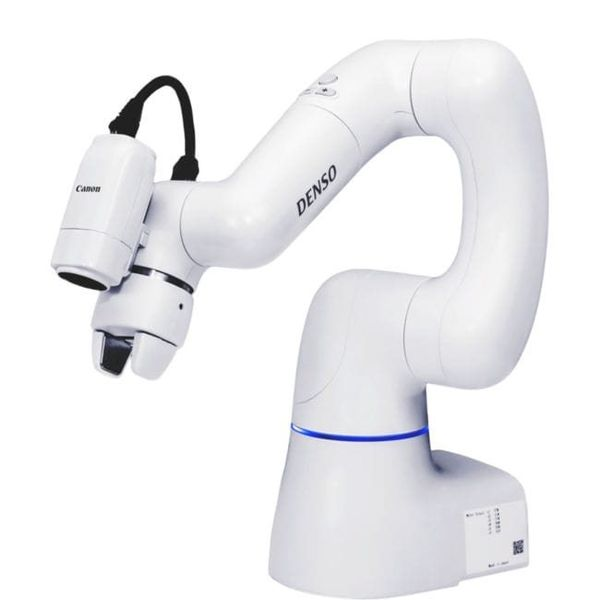

TCPはどう使うのか？↓

### TCPを複数登録しておくと便利


- 乳棒→ヘラをそれぞれTCPで登録
- 動作時にTCPを切り替える
- 同じ動作プログラムで乳棒もヘラも扱える

---

## ステップ②ロボットの座標系

### 関節座標系
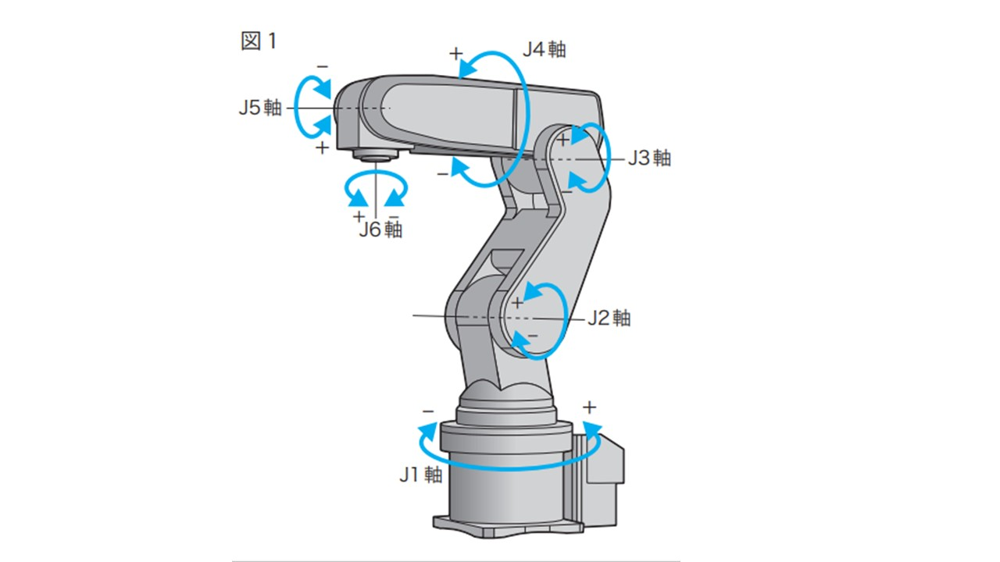
関節それぞれの角度を指定

### ベース座標系
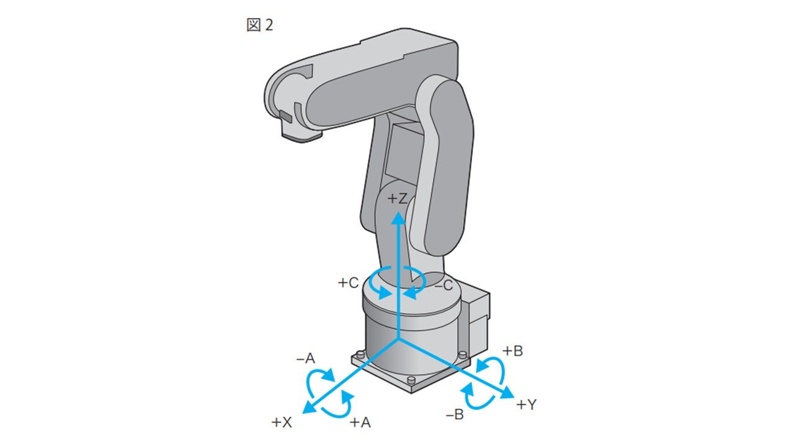
ロボットの根本を基準に直交座標系で指定

### ツール座標系
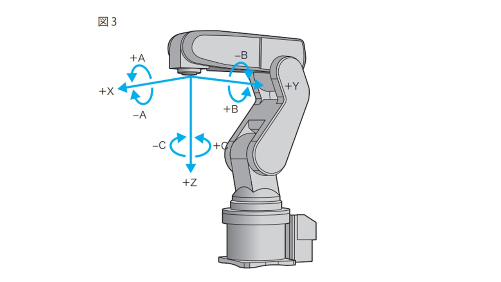
ロボットの手先を基準に直交座標系で指定

---

## ロボットの座標指定

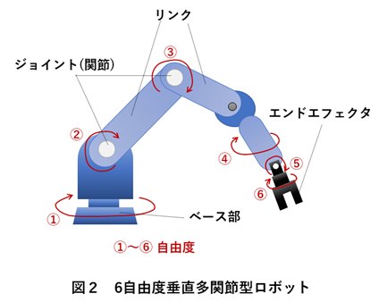

- **ジョイント(関節)**
  - モーターが入っている関節部
  - 各軸の回転・動作を制御
- **リンク**
  - ジョイントを繋ぐ部分
  - ロボットの腕の骨格
- **エンドエフェクタ**
  - 作業をする手先・付け替え可能
  - グリッパ、工具など用途に応じて交換

**座標系の指定方法：**
- 関節座標系：各関節の角度を直接指定
- ベース座標系：ロボット基準の直交座標で指定
- ツール座標系：手先基準の座標で相対動作

---

## 姿勢=位置+向き

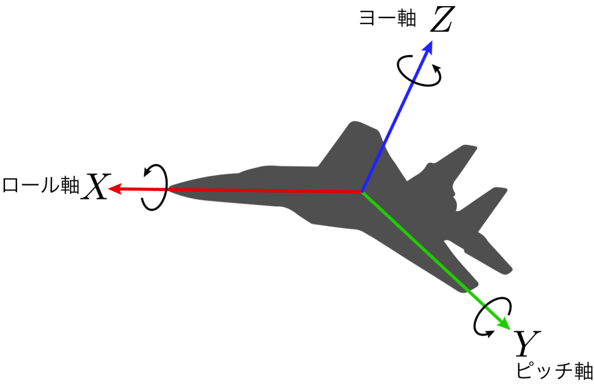

### 位置(position)
XYZ座標

### 向き(orientation)
オイラー角(XYZ軸回転)

姿勢 = 位置 + 向き

---

## 余談：ロボットアームの軸の数はなぜ6が多い

位置(XYZ) + 向き(XYZ) → 姿勢  
3次元 + 3次元 = 6次元

つまり6次元の姿勢を作るには最低限6軸(6次元)のロボットが必要

目的のタスクに合わせて適切な軸数を選ぶ必要がある

### 4軸ロボットの例
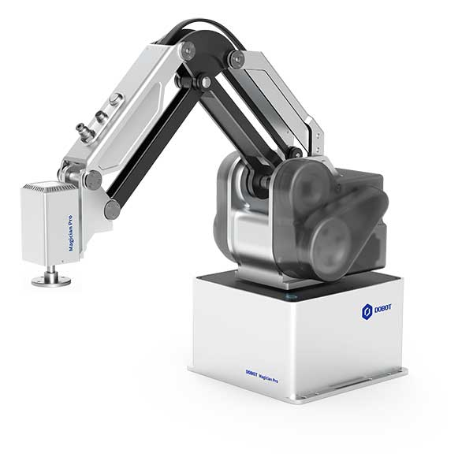
常に下向きという姿勢制限がある  
例)モノの移動はできるが向きを変えられない  
Dobot MG400  
Dobot Magician E6

### 6軸ロボットの例
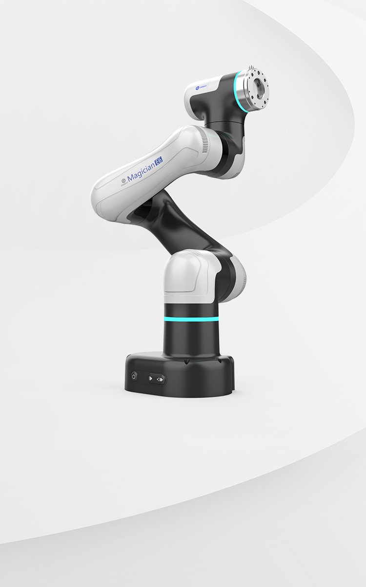
位置も向き自由に動かせる

---

## ステップ③ロボットモーションは3種類

**→ [モーション可視化](interactive_app/motion_viewer.html)**

[モーション可視化デモ](interactive_app/motion_viewer.html)

- PTP:関節空間で最短,高速
- LIN:直線動作,動きに制限
- CIRC:円弧動作,障害物回避

---

### PTPの詳細

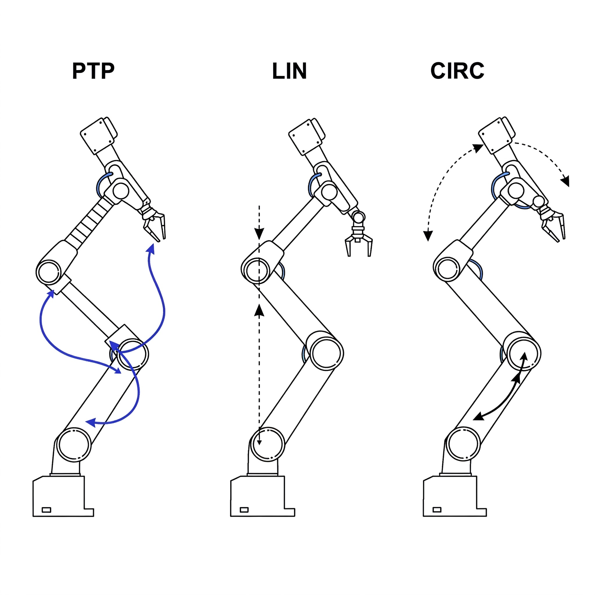

- **関節空間での最短経路**
- 各関節が同時に動き、最も速く目標に到達
- 手先の軌道は予測できない
- 障害物がない環境で使用
- 最も一般的な動作モード

### LINの詳細


- **直線動作**
- 手先が直線的に移動
- 姿勢も線形に変化
- 関節の可動範囲や特異点により動きに制限
- 精密作業や接触作業で使用
- PTPよりも時間がかかる

### CIRCの詳細


- **円弧動作**
- 中間点を指定して円弧を描く
- 障害物回避や滑らかな動作で使用
- 角を持つ物体の加工などに有効
- 3点（始点・中間点・終点）が必要

---

## 連続的なロボットモーション

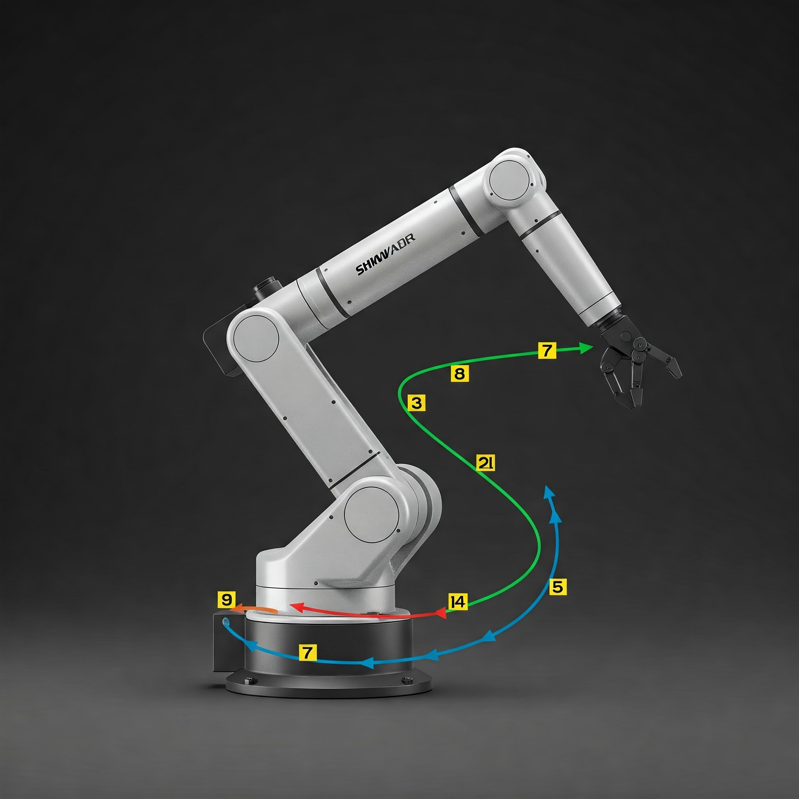

- 複数の姿勢(waypoints)を指定
- ただし、通常は各点で停止する動作のため、動きがガタつく

滑らかなモーションを作りたい場合↓

### 滑らかなモーションの作り方

[URブレンド半径デモ](interactive_app/ur_blend_radius.html)

- 厳密にwaypointsを通らずにショートカットすることで滑らかな動作を実現
- 左の図のようなやり方でショートカットを行う
- メーカーごとにこの機能の呼び方は異なる 例)Denso(パス動作)、UR(ブレンド半径)

---

## ロボットアームの精度について

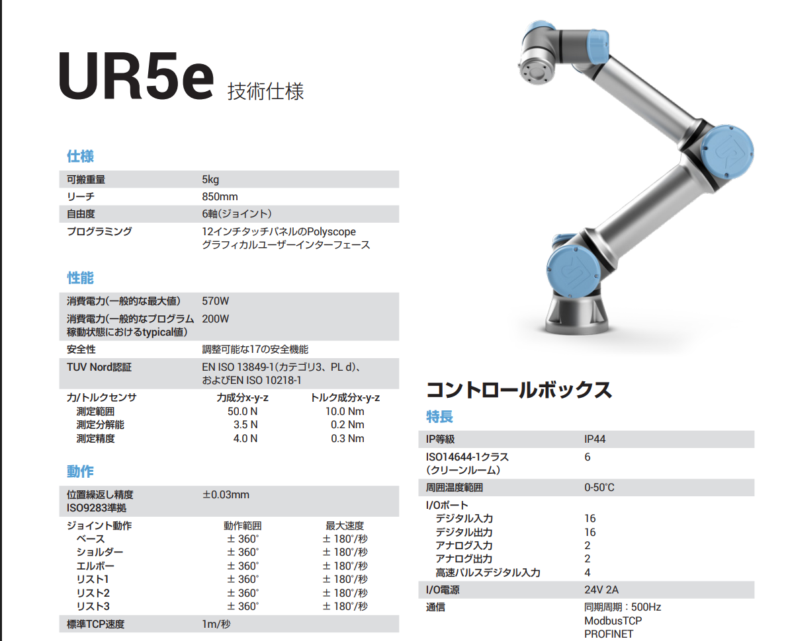

- 仕様書の精度は位置決め精度ではない！
- 同じ動作を繰り返したときの精度を記載
- 例えば、電源を入れなおすと位置が微妙にずれるので、毎回同じ位置決めを行いたい場合は電源をつけたままにしておくと良い

---

## ロボットアーム選定

ロボットアームの選び方  
ここでは協働ロボットを対象にしています

---

## ざっくり４種類

高価格  
多機能  
(≠多用途)

低価格  
単機能

### 垂直多関節ロボット
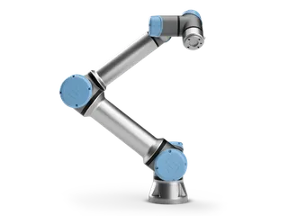

### 水平多関節ロボット(SCARA)


### パラレルリンクロボット
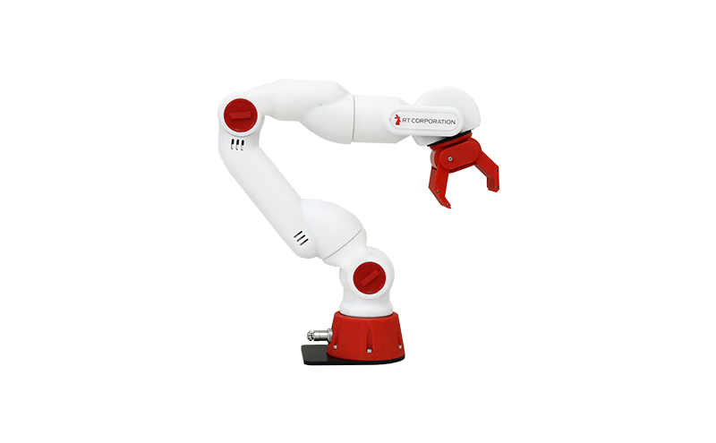

### 双腕ロボット
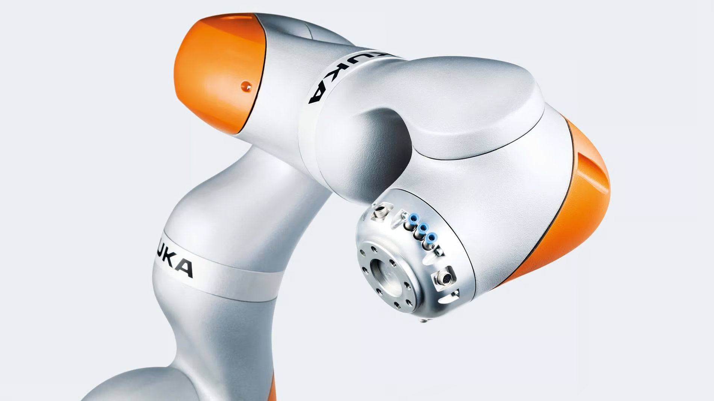

### 協働ロボット


### 人型ロボット
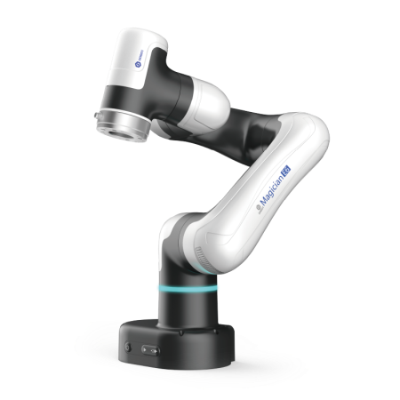

### 移動ロボット
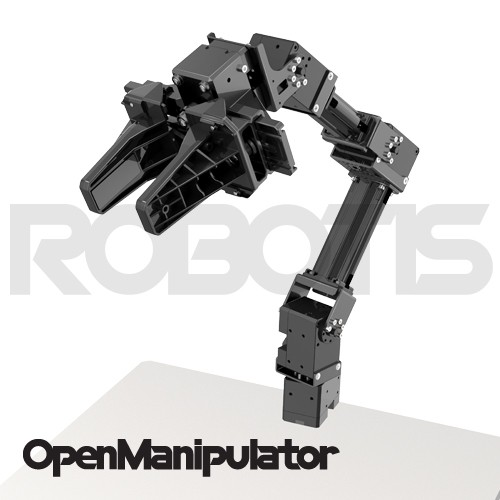

---

## 産業用ロボット系列

- FANUC、Yaskawa、Kawasaki、Denso、UR
- ハードウェアがしっかりしている
- 産業用ロボット+安全機能
- FAベースで使いにくい場合も
- 外部制御が限定的

---

## 高機能協働ロボット

- UR、Franka Emika、DOBOT
- 機能を妥協していない協働ロボット
- マニピュレーション研究でよく使用
- オープンな外部制御
- ROSから全機能制御可能

---

## 中華系ロボット

- Unitree、Robosen、Xiaomi
- とにかく安価
- ハードウェア品質は控えめ
- 用途によっては十分
- Pythonからの制御が整備
- 外部制御性は限定的

---

## 教育用ロボット

- LEGO Mindstorms、mBot、Raspberry Pi
- 3Dプリンタ使用で低コスト
- 剛性低く精密制御は困難
- 原理検証用途
- Python制御が整備済み
- 学習向け(実務には不向き)

---

## ダントツのオススメロボット


### ユニバーサルロボット

- 研究者からユーザまでオススメ
- 圧倒的に使いやすい
- ロボットが置物になりにくい
- 値段がボトルネック
- 2025年時点で400万円~

---

## 以上でロボットの基本動作はできるはず

Let's enjoy robot!

### 次のステップ

**もっと複雑な制御やセンサの統合をやりたい方は：**

- [ゼロからのROS入門](../ros-introduction/index.html) - ROSの基礎概念と学習リソース
- [アーム位置制御とモーションプランニング](../ros-arm-position-control/index.html) - MoveItとJTCによる制御実装
- [シミュレータや実機との接続](../ros-simulator-connection/index.html) - ros_controlとBringupパッケージ