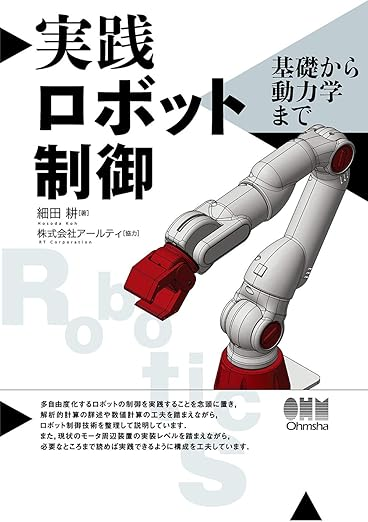
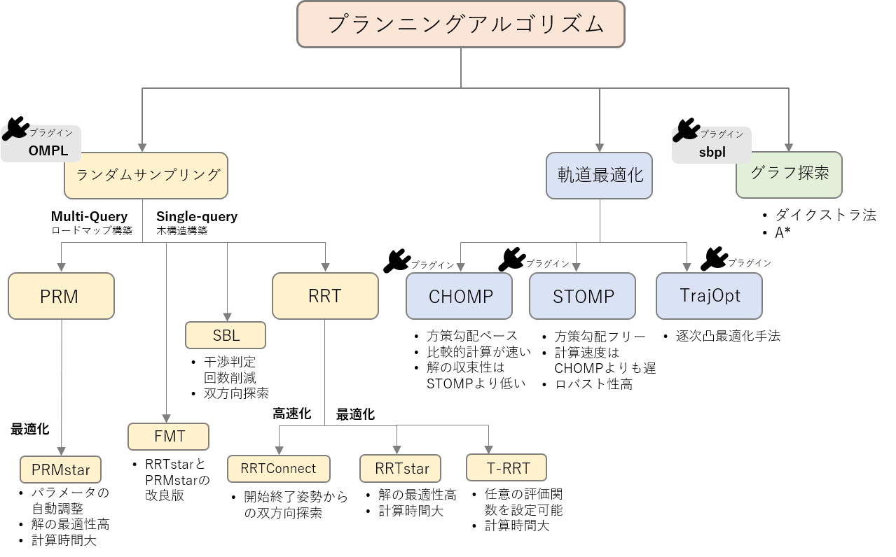
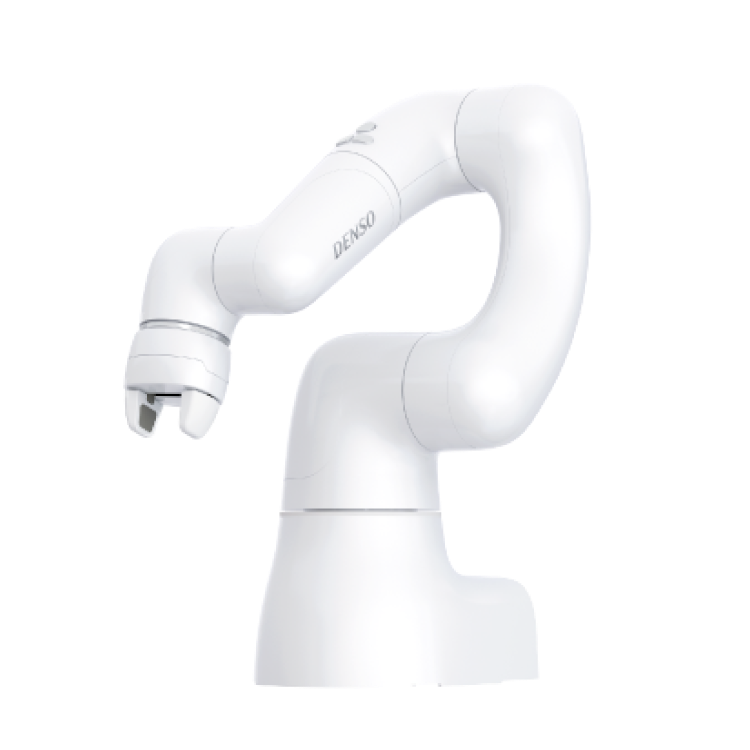
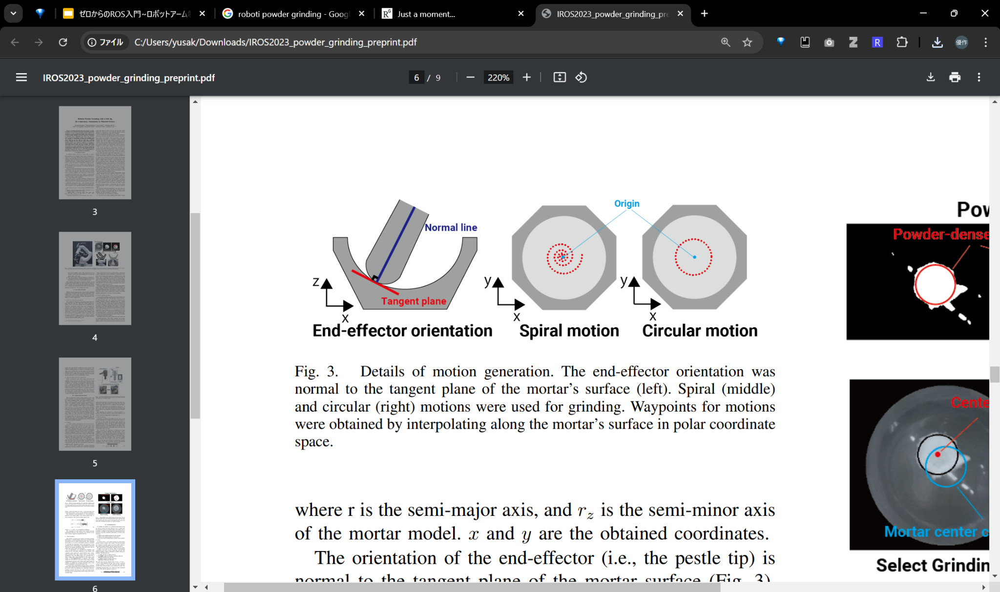
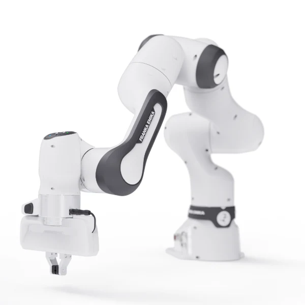
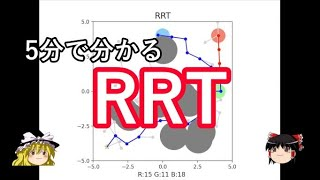
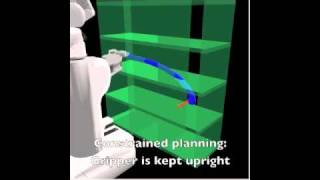
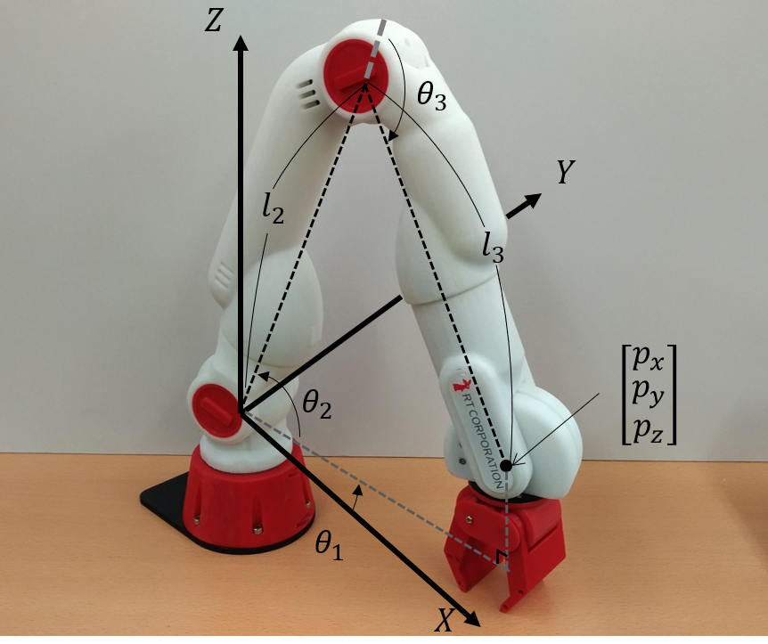
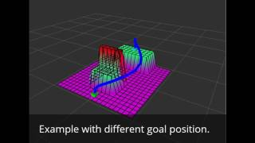

# ゼロからのROS入門 ~アーム位置制御とモーションプランニング~

**作成者**: 大阪大学 中島優作  
**戻る**: [← シリーズ一覧に戻る](../../index.html)

---

## ロボット制御の書籍

### イラストで学ぶロボット工学

初歩的な内容を網羅的に扱っていて最初に読むのにちょうど良い

### 実践ロボット制御

名著「ロボット制御基礎論」を現在版にブラッシュアップした書籍  
理論的な詳しさと実装面までの手引きが充実している

---

## このスライドの目的

メーカーが用意した制御では難しいロボットアームの軌道制御をするための資料になります

---

## アームの軌道制御とは、位置制御との違い


### 位置制御（メーカー制御）
基本的にwaypointsごとに動きを止める  
連続的に動こうとするとガタガタした動きになる

### 軌道制御
動きを止めないので、非常に滑らかな動きができる  
粉体粉砕などの連続的なタスクに有効

---

## ROSにおけるアーム制御の前提知識(読み飛ばしてもok)

---

## ロボットアームの構造


*FAプロダクツより引用(https://jss1.jp/column/column_162/)*

- **ジョイント(関節)** - モーターが入っていて動く
- **リンク** - ジョイントを繋ぐ  
  剛性が高い方がロボット動作の精度が良くなる
- **エンドエフェクタ(手先効果器)** - 作業をする手先  
  作業に応じて付け替える2本指や5本指のハンド吸盤

---

## アーム制御は組合せ

| ロボットが可能な制御 | 指定したい座標系 | やりたい制御 |
|---|---|---|
| 位置 | 関節座標系<br>(ジョイント座標系) | 位置 |
| 速度 | 直交座標系<br>(デカルト座標系) | 速度 |
| トルク |  | 力(トルク) |

例) 位置制御ロボットで直交座標系(XYZ空間)に対して位置制御したい  
→ XYZで座標を指定してロボットアームをうごかせる

---

## 多くのロボットは位置/速度制御

### 位置/速度制御ロボット
- Universal Robot
- DENSO
- Dobot

### 一部のロボットはトルク制御可能
- Franka Robotics
- KUKA

---

## よく使うROSのアームコントローラ

### 関節座標系に対して位置制御したい
**JointTrajectoryController**  
ROS標準のアームコントローラ  
位置 or 速度 or トルク制御ロボットに対応

### 直交座標系に対して位置/力制御したい
**CartesianControllers**  
位置 or 速度制御ロボットの手先に力覚センサを取り付けて位置/力制御を実現するROSパッケージ

---

## ROSのアームコントローラの命名規則

```
position_controllers/JointTrajectoryController
```

---

## 本編の内容

ここでは直交/関節座標系に対して位置制御したい場合の実装を扱います  
ROSの標準的なコントローラで最もよく使われます

### 具体的な実装を2つ紹介

#### ①MoveIt
障害物回避ありのモーションプランニング  
ピッキングなど一瞬しか接触しないタスクで使う

#### ②JointTrajectoryController
障害物回避なしのモーションプランニング  
粉体粉砕など常に接触するタスクで使う

---

## MoveItによるアーム制御

---

## MoveItで何ができるか

ROS用のアーム制御ソフトウェア

### MoveIt 3 Step
1. 目標姿勢を指定
2. 障害物を回避可能なモーションプランニング
3. 実行！



---

## MoveItのモーションプランニングの手順

1. **ロボット手先の目標姿勢決定：** 直交座標系 or 関節座標系
2. **逆運動学：** 1の目標姿勢が直交座標系なら関節座標系に変換
3. **モーションプランニング**
   - 障害物：Planning Sceneで予め設定
   - パスプランニング：障害物を回避するパスを計算
4. **実行：** パスをJointTrajectoryControllerで実行



---

## 手先の姿勢の表現

姿勢(pose)は位置(position)+向き(orientation)で表現

- **位置：** XYZで表す
- **向き：** 位置制御ではオイラー角 or クオータニオンを使う
  - **オイラー角** - 直観的にわかりやすいがジンバルロックがあるので軌道や軌跡の計算には向かない
  - **クオータニオン** - 人にはわかりにくいがジンバルロックがないので軌道や軌跡の計算に便利


---

## 姿勢の表現 - オススメの実装

- **目標姿勢の計算は直観的にわかりやすいオイラー角**  
  ここでzyxオイラーで指定
- **ロボット動作ではオイラー角→クォータニオンに変換**  
  pythonだとscipy.Rotation等でオイラー角とクオータニオンの変換を計算可能



---

## 逆運動学の必要性

XYZでロボットの手先姿勢を指定したい  
ただ、動かせるのはロボットの関節  
そこで手先姿勢→ロボットの関節をする必要があり、これを逆運動学という


*https://rt-net.jp/humanoid/archives/2652*

---

## 逆運動学の解き方(IKソルバー)

### 解析解
ロボットの構造に基づいて導出された式を用いて、関節角度を直接計算する方法  
数値解より計算が早くロバスト性も高い  
普通のロボットアームは解析解が存在するような機械的構造をしている

### 数値解
反復計算(最適化計算)によってロボットアームの関節角度を近似的に求める手法  
反復計算が必要なので解析解より計算時間がかかる  
現在は計算機の速度も上がっているので数値解を使うことが多い

---

## MoveIt2で使えるIKソルバー

### 数値解ソルバー
- **pick_ik** - MoveIt2用に実装されたソルバーでMoveIt2ならオススメ  
  グローバルミニマム：進化的アルゴリズム、ローカルミニマム：勾配降下法を組みあわせている
- **TRACK-IK** - ROS1と共通ソルバーを使いたい場合にオススメ  
  ニュートン法とSQP(逐次二次計画法)のハイブリッドで収束

### 解析解ソルバー
- **IKFast** - 高速にIKを解きたい場合(ただ数値解より解が収束しにくい)

---

## Pythonで使えるIKソルバー

### 数値解ソルバー
- **TRACK-IK** - これまで長年使われてきた実績があるので安心して使える  
  track_ik_pythonにpython実装もある
- **QuIK** - 2024年に発表されたばかりの高速な数値会IK手法  
  投稿を見る限り解が近いIKであれば10us程度で解けそう  
  ROS2用のC++実装やpythonラッパーが公開されている

---

## MoveIt2で使えるパスプランニング

- **産業用ロボモーション**
  - Pilz Industrial Motion Planner (障害物を考慮しない)
- **サンプリングベース**
  - OMPL
- **最適化ベース**
  - CHOMP
  - STOMP


*https://opensource-robotics.tokyo.jp/?p=4313*

---

## サンプリングベースの手法(RRT)

MoveItでデフォルトで使う

- ランダムにパスを伸ばして障害物がなかったら採用、を繰り返す
- 単純なRRTだとジグザグなので、実際は後処理をかけてスムーズにする
- MoveItのデフォルトではスタートとゴールから同時に伸ばし収束性を良くしたRRT Connectが使われる


---

## 最適化ベースの手法(CHOMP)

- **コスト：** 障害物の距離を遠く、軌道の距離を短く、など
- **最適化：** 勾配降下法
- コストの設計と初期軌道の引きの良さによって収束時間や得られた軌道の良しあしが決まる
- 障害物が多い実用場面では正直使いにくい



---

## 最適化ベースの手法(STOMP)

- **コスト：** 障害物の距離を遠く、軌道の距離を短く、など
- **最適化：** 確率的最適化
- 軌道にノイズを載せて最適化
- 軌道は最適化で決めるけど、最適化はサンプリングベースなので、最適化とサンプリングのハイブリッドでもある
- 滑らかさはCHOMPより劣るが解が収束しやすく実用上は使いやすい

---

## JointTrajectoryControllerによるアーム制御

略してJTC

---

## JTCでの実装の流れは5ステップ

1. ロボット手先の目標姿勢決定(XYZ座標で指定)
2. 逆運動学(手先目標姿勢に対応するロボット関節角度計算)
3. 軌道・軌跡生成
4. 実行



---

## 目標姿勢の計算

- powder_grindingパッケージだとmotion_generatorが行う
- 1つの姿勢ではなく、連続的な姿勢の変化を計算
- 連続的な姿勢の集まりをwaypointsと呼ぶ(図の赤点のこと)



---

## 軌跡・軌道生成

- **軌跡：** 逆運動学で得た解(JointTrajectory)を並べたもの  
  どこを通るのかという空間的な情報を列挙したもの
- **軌道：** 時間的な情報を加えたもの
- JointTrajectoryControllerでは軌道計算を自動的に行ってくれる
- ユーザーが渡すのはPositionとTimeFromStartだけ


*※軌跡と軌道の言葉の定義は「実践 ロボット制御」での定義を使っています*

---

## 実行

- TopicやActionで軌跡(JointTrajectory)を送信することで実行
- **Topicで送った場合：** 即時反映される
- **Actionで送った場合：** 目標到達までの状態や、過負荷などで目標のTrajectoiryからずれていないかを確認できる


*参考資料: joint_trajectory_controller.md*

---

## JTCの実装例

| 項目 | 使用技術 |
|---|---|
| 目標姿勢の決定 | Scipy Rotation Module |
| 逆運動学 | TrackIK |
| 軌道生成 | JointTrajectoryController |
| 軌跡生成 | JointTrajectoryController |
| 実行 | JointTrajectoryController |