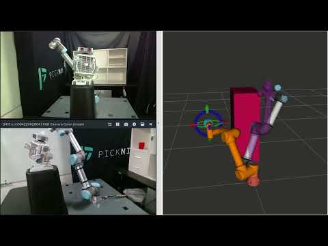
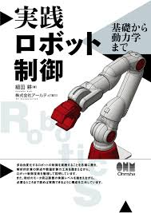
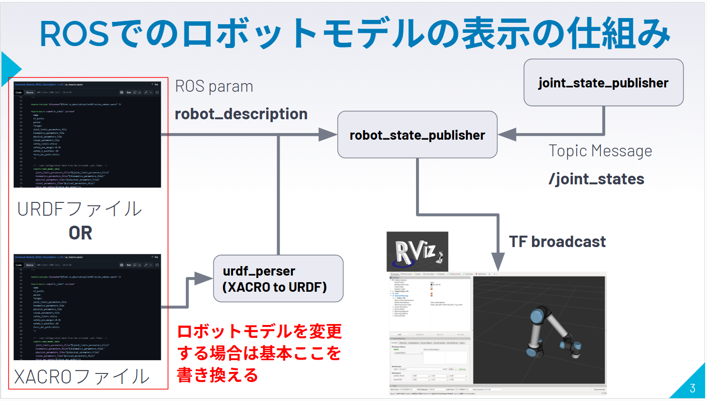
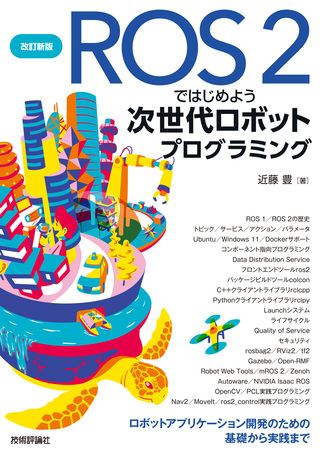
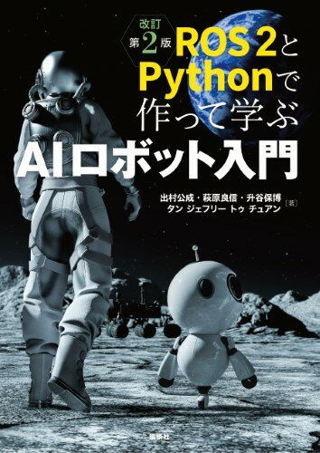
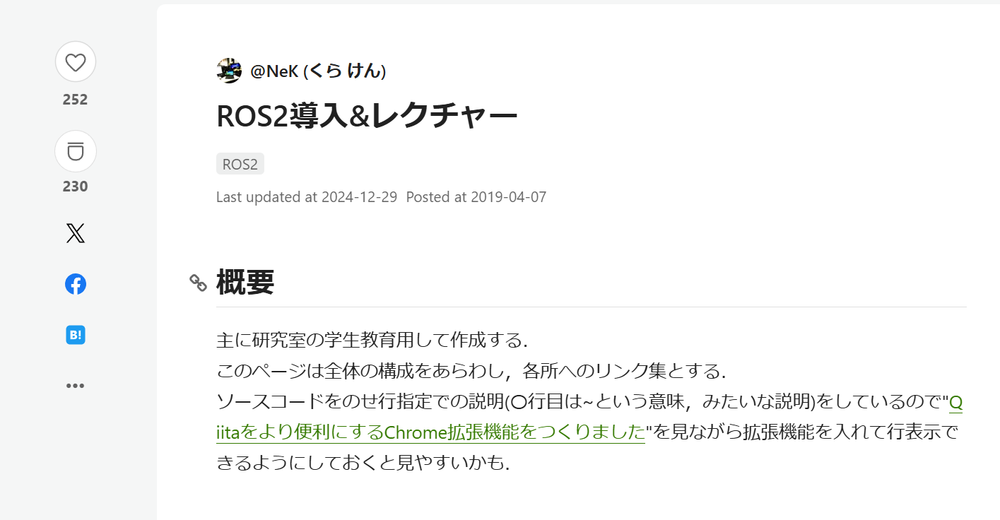
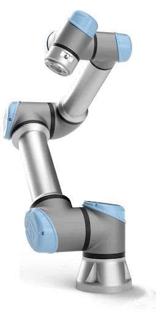
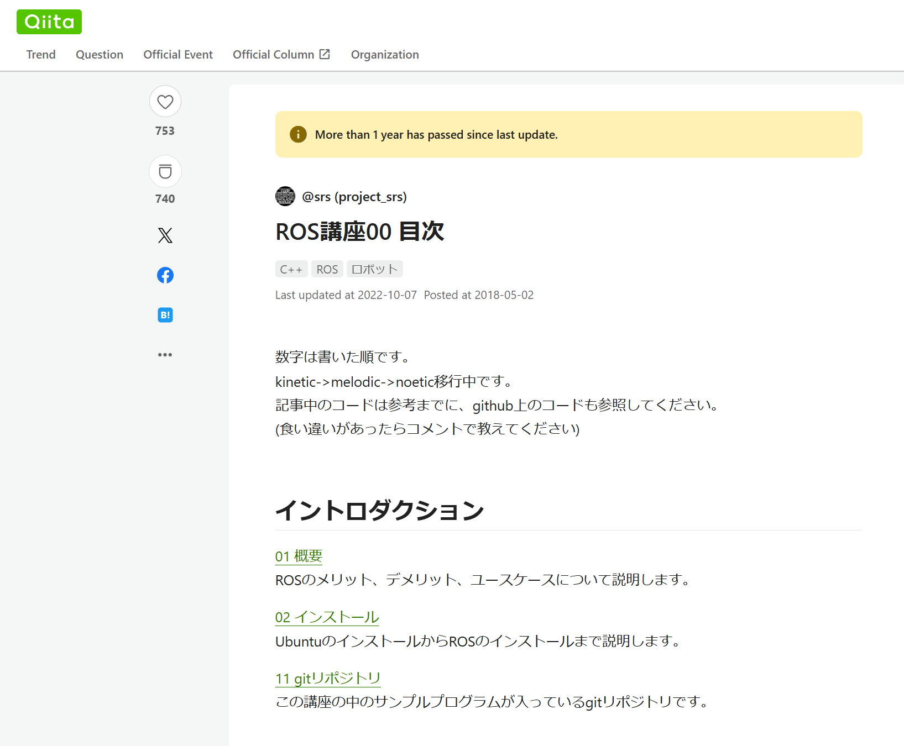

# ゼロからのROS入門

**作成者**: 大阪大学 中島優作  
**戻る**: [← シリーズ一覧に戻る](../../index.html)

---

## はじめに

この資料はROSの中でもロボットアーム制御に特化した内容です  
移動ロボットは対象外です

---

## このスライドの使い方

ロボット制御やROSの使い方の解説がメイン  
実装を始めると、システムの中身が分からず挫折しがち  
本スライド後半でオススメを紹介

- 書籍やハンズオン

必要最小限のロボット制御とシステム実装を具体的解説  
特にROSの使い方はほとんど触れませんので別資料を参考にしてください

本スライド資料  
知識  
実践

---

## ゼロからのROS入門シリーズ

内容別にスライドを作成しています  
スライドは作成途中のものもありますのでご容赦ください

- 環境構築のためのDockerとUbuntuの基礎
- ロボットアーム制御とモーションプランニング
- ロボットモデルの表示
- ROSパッケージの形式知と暗黙知
- シミュレータや実機との接続(ros_control)

---

## ROSの勉強にオススメの資料

---

## ROSとは

ROSの説明はROS日本コミュニティーの資料を参照

---

## 可能であれば誰かに聞きながら進めるのが良いです

ROSをやってて一番辛いのは、ロボットを動かしたいのにそこまで到達できずに挫折してしまうことです  
挫折しそうな時に相談できる相手がいると良いです  
ROSのJapan User GroupのSlackがまずは聞きやすいかもしれません

---

## 一人でROSを始める場合まずはここからが良いと思います

### ROS 2とPythonで作って学ぶAIロボット入門

- ロボット制御もROSも知らない人にオススメ
- ROSの環境がDockerで用意されているので、すぐに勉強を始めることができる
- ロボット制御の初歩を幅広く扱っている
- この書籍から次のステップに進むには、ROSとロボット制御をより深く理解する必要があります

---

## ROSのオススメ参考資料(ロボット制御は別で学ぶ必要あり)

### ROS 2とPythonで作って学ぶAIロボット入門
- ロボット制御もROSも知らない人にオススメ
- ロボット制御も初歩のみ扱っている

### ROS 2ではじめよう 次世代ロボットプログラミング
- ROSの詳しい解説本
- ロボット制御はほとんどない

---

## ROSのオススメ参考サイト(ロボット制御は別で学ぶ必要あり)

### ROS講座
- ロボットの動作だけでなくROSのプラグインやGUIの作り方など非常に幅広い題材で参考になります
- ROS1版がコンテンツが豊富ですが、ROS2版もあります

### ROS2導入&レクチャー
- 研究室の学生を対象としているので、ROS2のコーディングスタイルなど初見でつまずきやすい内容も丁寧に扱っています

---

## ROS1とROS2の所感

2025年5月で(Ubuntu20.04と同時に)ROS1のサポートは終了  
今後はROS2に移行するように見えるが。。。

### 個人的な所感

- 研究レベルだとROS1も特に国内はまだまだ使われている印象
- 正直、研究だとパッケージが豊富なROS1の方が使いやすい
- ROS2は開発が盛んで安定して動かせないことも多く玄人向け
- 特に初心者はエラーで詰まって挫折しやすい
- Ubuntu22.04でもROS1を使いたい人がいるので文献もある
- Ubuntu22.04のホスト環境へのROS1インストール
- 僕はUbuntu22.04でDocker上にROS1環境を構築して使っていますが特に不具合はないです
- 趣味,研究 → ROS1
- 実務,ROS2の書籍で勉強 → ROS2
- で27年までは良いのではという気がします(慣れたらもちろんROS2へ)

---

## ロボット制御のオススメ資料

---

## ロボット制御のオススメ参考資料

### イラストで学ぶロボット工学
- 初歩的な内容を網羅的に扱っていて最初に読むのにちょうど良い

### 実践ロボット制御
- 名著「ロボット制御基礎論」を現在版にブラッシュアップした書籍
- 理論的な詳しさと実装面までの手引きが充実している

---

## ロボット制御の資料を探す際の注意点

タイトルと中身の対応が分からない  
ロボット制御は主に移動とアームがあるが書籍名は「ロボット工学」や「ロボット制御」など一見ロボットアームを扱っているとわからないようなタイトルの書籍も多い

また、レベル感と目的が様々で、何から読んだらよいのか分からない  
アーム制御の書籍はROS等の具体的な実装は書かれていない  
ROSの書籍はアーム制御の理論面は書かれてはいない  
しかし実際は両方を知っていないといけない

---

## ロボット制御の資料を探す際の注意点

### 書籍が古い

ロボットアーム制御の基礎理論は1980年代にできあがったが、当時は今のように6軸アームロボットが普及していなかったので、書籍は3軸などの簡単なモデルロボットを扱っている

また、当時はコンピュータの速度も遅かったので、運動学等は主に解析解で得ることが多かった

現在は6次元以上のアームを使うことが当たり前でコンピュータの速度も速いため数値解法を使うことが多い。特に2000年以前の書籍は勉強にはなるものの現代的な実装には合わないことがあるので注意してもらいたい。

