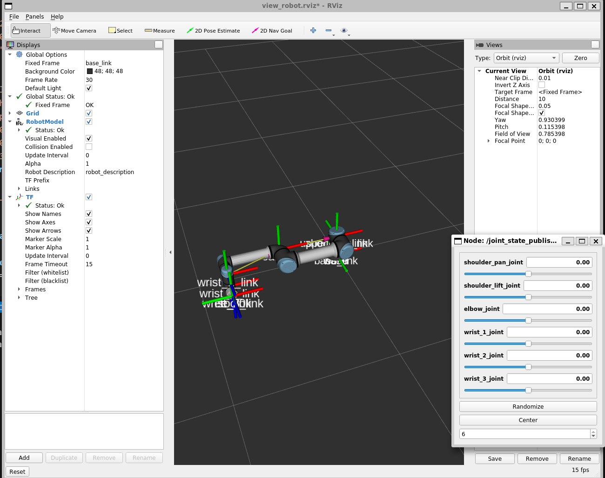
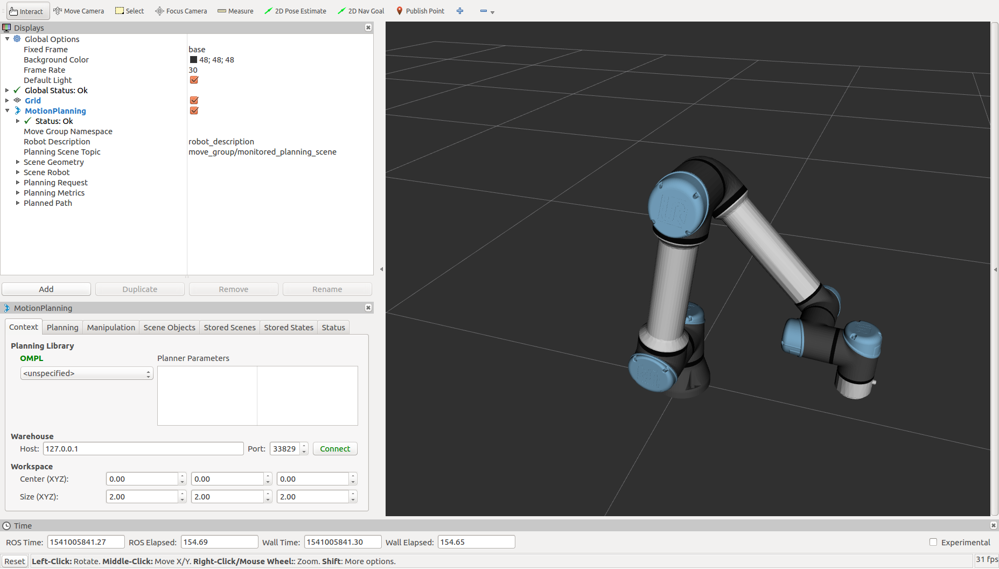
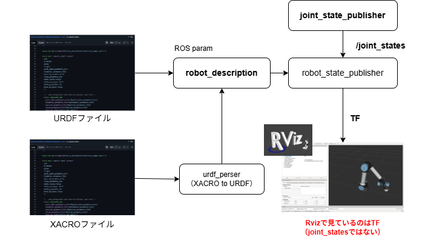
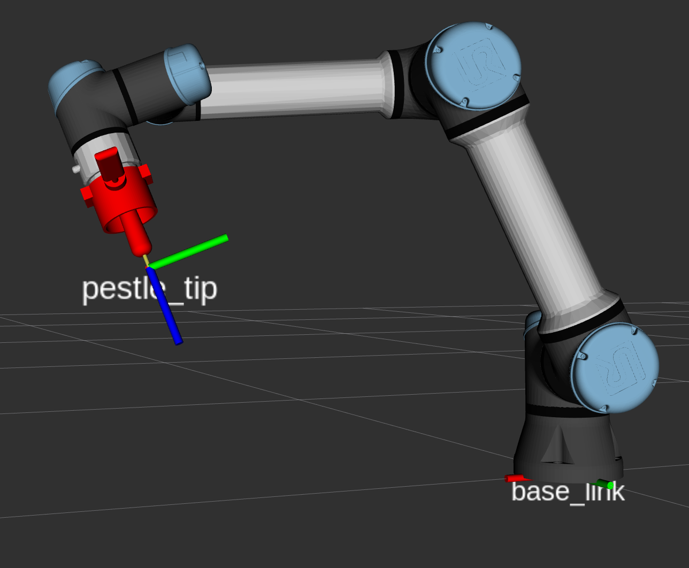
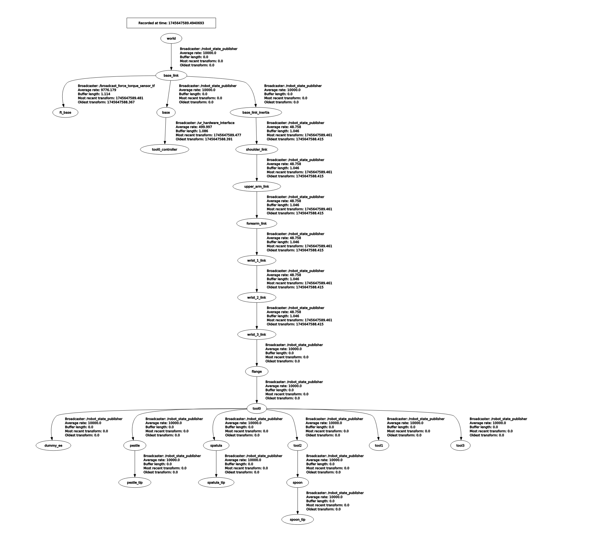

# ゼロからのROS入門 - ロボットモデルの表示

**作成者**: 大阪大学 中島優作  
**戻る**: [← シリーズ一覧に戻る](../../index.html)

---

## 本スライドのゴール



- 左にようにロボットモデルをRviz上に表示できるようになる
- モデルがすでにある人、先に動作生成をやりたい人→[アーム位置制御とモーションプランニング](../ros-arm-position-control/index.html)

---

## Rvizとは？



- ロボットのモデルやセンサ情報などを3次元で可視化するためのツール
- デバッグや動作確認で使う
- あくまで可視化ツールなので、これがなくてもロボットの動作は可能

---

## ロボットモデルを表示するまでの流れ

1. ステップ1：URDFでロボットモデルを書く
2. ステップ2：URDFを読み込ませて表示

---

## ロボットモデル表示の全体像



データの流れを理解することが大切

---

## ステップ1：URDFの書き方


*※左側の部分を重点的に解説*

---

## ロボットモデル = ロボットアームの構造



- **ジョイント(関節)**: モーターが入っていて動く
- **リンク**: ジョイントを繋ぐ。剛性が高い方がロボット動作の精度が良くなる
- **エンドエフェクタ(手先効果器)**: 作業をする手先。作業に応じて付け替える

---

## URDF（Unified Robot Description Format）

ジョイントとリンクの定義が書いてあり、以下が主な要素

- **Joint**: 自由度(回転か並進か等), 親リンクと子リンク
- **Link**:
  - **Visual**: JointとLinkは骨組みしか定義していない。ここでstlファイルなどを定義して肉付け
  - **Collision**: 干渉計算用の肉付け(通常は計算量を減らすためにSTLではなく円柱などシンプルな形状)
  - **Inertial**: 物理計算用の質量や慣性テンソルの定義

---

## XACRO（XML Macros for Robots）


- ロボットアームはリンク→ジョイントの繰り返し構造が多いのに、URDFはべた書きなので効率が悪い
- URDFにマクロ(関数等)を追加したのがXACRO
- XACRO読み込み時に変数を渡す
- 関数で繰り返し構造の定義を簡素化する

---

## エンドエフェクタを追加したい場合

XACROのinclude機能が便利です  
既にあるURDFやXACROを呼び出せるのでエンドエフェクタ部分だけ自分で追記すればよいです

```xml
<?xml version="1.0"?>
<robot xmlns:xacro="http://www.ros.org/wiki/xacro" name="robot_with_end_effector">
  <xacro:include filename="$(find my_robot_arm)/urdf/arm.xacro"/>
  <link name="end_effector_base"/>
  <joint name="arm_to_ee" type="fixed" />
  <link name="end_effector_1"/>
</robot>
```

---

## ステップ2：URDFの表示のlaunchファイル


*※右側の部分を重点的に解説*

---

## launchファイルの例

```xml
<launch>
  <arg name="model" default="$(find grinding_descriptions)/urdf/ur/ur5e.urdf"/>
  <param name="robot_description" command="$(find xacro)/xacro '$(arg model)'" />
  <node name="joint_state_publisher_gui" pkg="joint_state_publisher_gui" type="joint_state_publisher_gui" />
  <node name="robot_state_publisher" pkg="robot_state_publisher" type="robot_state_publisher" />
</launch>
```

必要に応じて、自分で作成したURDFファイルを使ってください

---

## URDFの表示デモ


TFを見るとURDFで記述したjointとlinkが動いているのが見える

---

## TFとは？

TF = Transformの略  
ROS標準搭載のシステムの1つ  
実際はTFの改良版のTF2を使う

---

## 機能1：座標変換



- エンドエフェクタのベース座標系やツール座標系の計算
- 複数の座標系間での位置・姿勢変換

---

## 機能2：座標管理

- 座標をツリー構造で管理(使えるのは開ループのみ、閉ループは使えないので注意)
- 座標データは時系列。例えば1秒前の座標で計算すると現実と計算で座標がずれる
- そういう不都合が生じないように「n秒以内に取得した座標しか計算に使わない」などの管理をTFが行ってくれる
- 詳細な解説はTF完全理解という資料が分かりやすい