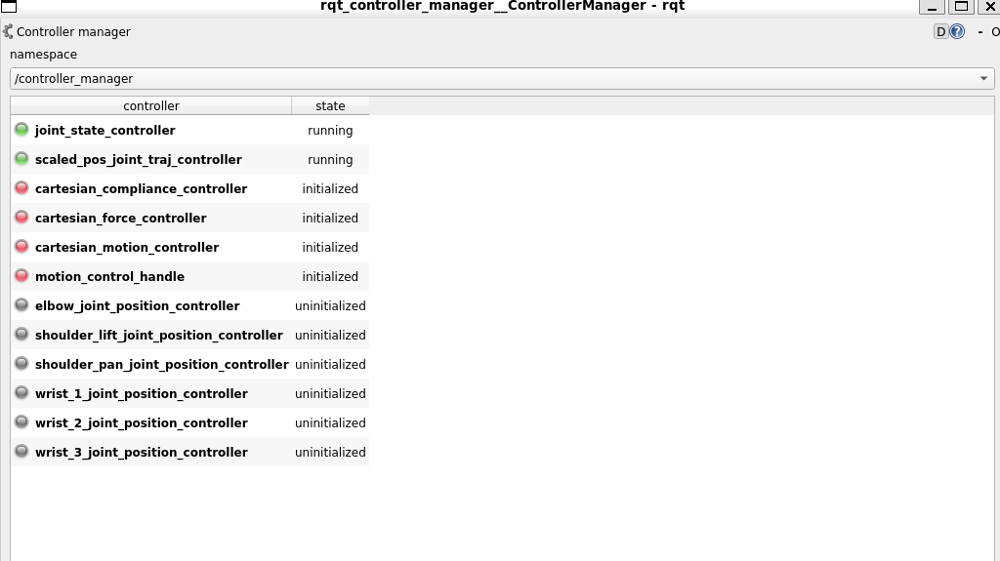
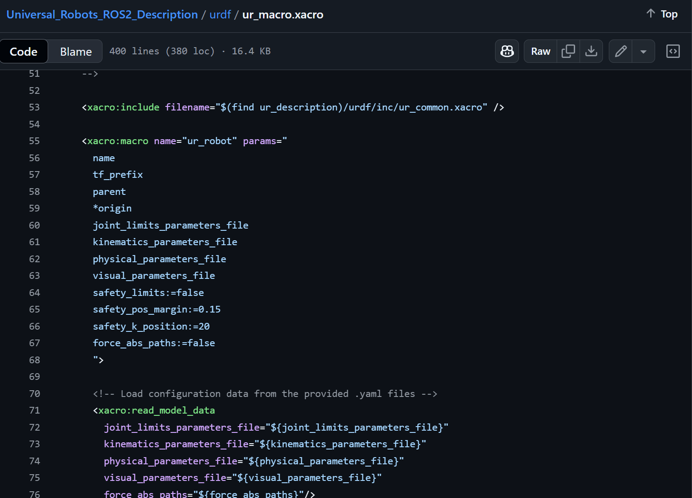
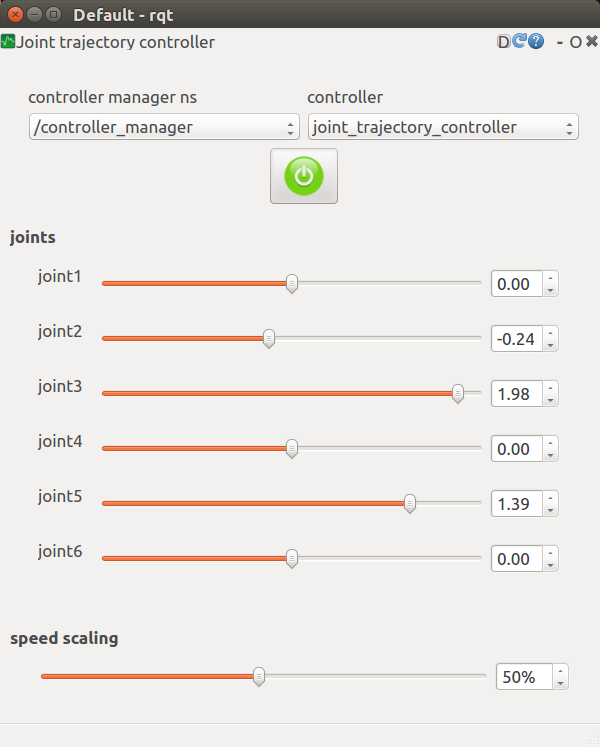

# ゼロからのROS入門 - シミュレータや実機との接続

**作成者**: 大阪大学 中島優作  
**戻る**: [← シリーズ一覧に戻る](../../index.html)

---

## 本スライドのゴール

- Bringupパッケージのlaunchファイルが書けるようになります
- 新しいロボットのROS対応で必要です
- シミュレーションやコントローラとの接続について理解できます
- Gazeboシミュレータ以外にMujocoシミュレータを使いたい場合や、力制御用等の公開コントローラを使いたい時に助けになります

---

## シミュレータや実機との接続方法

ROSではros_control(ROS2はros2_control)というロボット制御のための標準アーキテクチャが用意されているので、これを使ってロボット制御、シミュレータや実機との接続を行います



---

## ros_controlの概念図



- Controller manager: コントローラ管理
- 位置制御や力制御をここで切り替え
- シミュレータ(sim:=true) / ロボット実機(sim:=false)

---

## 復習：ROSでのロボットモデルの表示の仕組み


Rvizで見ているのはTF（joint_statesではない）

---

## BringupのLaunchのざっくり解説

### UR5eのLaunchファイルの例

```xml
<group if="$(arg sim)">
  <include file="$(find robot_bringup)/launch/inc/load_contoller.launch">
    <arg name="controller_config_file" value="$(arg controller_config_file)" />
    <arg name="controllers" value="$(arg controllers)" />
  </include>
  <node name="fake_joint_driver" pkg="fake_joint_driver" type="fake_joint_driver_node" />
</group>
<group unless="$(arg sim)">
  <include file="$(find robot_driver)/launch/robot_driver.launch" />
  <node name="robot_state_publisher" pkg="robot_state_publisher" type="robot_state_publisher" />
</group>

<include file="$(find onolab_ur5e_moveit_config)/launch/move_group.launch"/>

<node name="rviz" pkg="rviz" type="rviz" args="-d $(arg rviz_config)" />
```

---

## Launchファイル説明

- sim:=trueでシミュレータ用のロボットドライバを起動
- sim:=falseで実機のロボットドライバを起動
- ロボット制御用にMoveItを起動
- ロボット表示用にRvizを起動

---

## ロボットアーム制御

ここではロボットアーム制御用のツールを紹介

*アルゴリズムは「ロボットアーム制御とモーションプランニング」スライドで紹介*

---

## Controller Manager

- ロボット制御用のコントローラをプラグインで管理するツール
- GUIでの切り替えが便利(コードでも切り替え可能)

**GUIを起動するコマンド**
```bash
rosrun rqt_controller_manager rqt_controller_manager
```



---

## Joint Trajectory Controller GUI

- アーム位置制御の基本コントローラがJointTrajectoryControllerです
- 専用GUIがあり動作確認で便利

```bash
rosrun rqt_joint_trajectory_controller rqt_joint_trajectory_controller
```

---

## シミュレータの種類

### ①簡易シミュレータ
- ロボット動作確認のための簡易シミュレータ
- ロボットと周りの環境との接触は考慮されません(動作が軽い)
- 主に計算したモーションが正しいかの確認で使います
- ROS1：外部パッケージのfake_jointを使って実装
- ROS2：標準機能のMock Componentsで実装

### ②物理シミュレータ
- ロボットと周りの環境との接触等を含めた物理シミュレータ
- ロボットと周りの環境との接触も考慮します(計算重い、GPU必須)
- Gazebo、Mujocoといった物理シミュレータを使います
- 主にロボット学習のテスト環境やSim to Realで使います

*※僕らが開発で普段使っているシミュレータは①です*