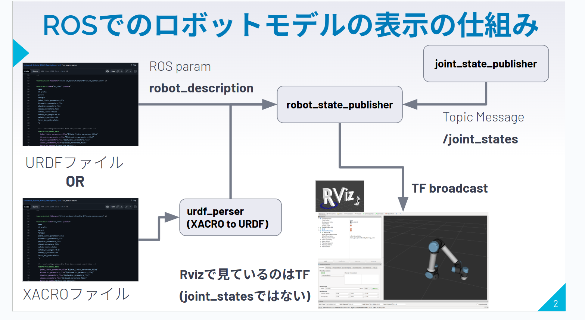

# ロボットアーム入門解説資料 制作ガイド

ロボットアーム入門（ゼロからのROS入門）に関する解説資料（スライド、フローチャート、可視化アプリ）の制作手順をまとめたものです。

-----

## 🛠️ 開発環境と事前準備

作業を始める前に、開発環境のセットアップと、Googleスライドからのデータ移行および初回スライド生成を行います。

### 開発環境と使用ツール

  * **開発エディタ**: **Visual Studio Code (VS Code)**
      * **拡張機能**:
          * `Draw.io Integration`: VS Code上でフローチャートを編集するために使用。
          * `Live Server`: `reveal.js`スライドをリアルタイムでプレビューするために使用。
  * **スライド**:
      * **元データ**: Google スライド
      * **最終形式**: reveal.js
      * **生成AI**: Claude Code
  * **フローチャート**:
      * **作成ツール**: draw.io
      * **生成AI**: Gemini 2.5 Pro
  * **可視化アプリ**:
      * **生成AI**: Gemini 2.5 Pro

### Googleスライドからの移行と初回スライド生成

1.  **画像ファイルの準備**:
    GoogleスライドをPowerPoint形式（`.pptx`）でエクスポートします。その後、ダウンロードした`.pptx`ファイルの拡張子を`.zip`に変更して解凍し、画像ファイルを抽出します。

2.  **テキストファイルの準備**:
    Googleスライドの「ファイル」メニューから「形式を指定してダウンロード」→「プレーンテキスト（.txt）」を選択し、スライドの全テキストを書き出します。

3.  **初回スライドの生成プロンプト**:
    準備した画像とテキストから、**Claude Code**を使い`reveal.js`の雛形を生成させます。

    ```prompt
    "origin_slides"ディレクトリに格納されている画像とテキストファイル（.txt）を基に、reveal.js形式のプレゼンテーションを新規作成してください。

    # 要件
    - 画像は"media"ディレクトリにコピーし、スライド内から参照してください。
    - スライドの文章は、提供されたテキストファイルの内容を基に構成してください。
    ```

-----

## 1. スライド内容の修正

生成された`reveal.js`スライドのレイアウトや内容を、以下のプロンプトで修正します。

**プロンプト例 (Claude Code):**

reveal.jsスライドを、以下の指示通りにスライドを作ってください
cssなどは他のスライドを参考にしてください
claude.mdをスライドの内容に合わて作成してください。


# 全体的な方針
- 全てのスライドからアニメーション効果を削除する。
- 背景画像を除き、レイアウトは原則として「左に画像やアプリ、右にテキスト」で統一する。iframeも同様。
- アプリを埋め込む場合は以下のようにする
```html
<p style="text-align: center; margin-bottom: 10px;">
                    <strong>→ <a href="interactive_app/app_name.html" target="_blank"
                            style="color: #3b82f6; text-decoration: underline;">全画面表示</a></strong>
                </p>
                <iframe data-src="interactive_app/app_name.html" width="100%" height="200px"
                    frameborder="0"></iframe>
```
# 具体的な変更点
番号はスライドのページ数を表しています
ネストした番号はスライドの縦方向へのネストを表しています
「」内はスライドタイトルを表しています
空白は修正なし
1. 
2. 
3.  ロボットの設置
    1.  左側にslides/robot-arm-hardware-integration/media/robot_on_bread_bourd.JPGとslides/robot-arm-hardware-integration/media/robot_on_alminum_frame.JPGの2枚を並べて表示
4. エンドエフェクタの取付
   1. 下に<p>でhttps://kikakurui.com/b8/B8436-2005-01.htmlのリンクを貼る
5. ロボットアームとPCの接続
   1. 図は不要、PCに付属のLANポートかUSB-LAN変換を使用して接続します、下に<p>で「LANの設定方法↓」を追記
   2. IPアドレス、サブネットマスク、ゲートウェイの設定方法を追記    
   IPアドレスは固定にします、
   3. ポート開放の方法を追記
    ブラウザから見る場合は不要
    pythonなどから制御する場合は必要
    Windowsの場合、ファイアウォールの設定が必要
    Ubuntuの場合、ufwの設定が必要
6. グリッパの接続方法
   1. メーカー対応品以外は、自分で通信などを実装する必要があります
   2. グリッパの接続方法は、電源、グランド、通信の3つを接続します
   下に<p>で「推奨電源↓」を追記
    3. 12V or 24Vの電源を用意することが多いです、電源はスイッチング電源(swichingAC.png)が推奨です、
   下に<p>で「通信の方法↓」を追記
    4. 通信はRS485をよく使う
7. RS485通信の概要
   1. データ通信の基本、電気信号で情報(ビット)をやり取りする方法、最もシンプルなものはRS232で電気信号がHigh(1)とLow(0)の2値でやり取りするもの
   文字はASCIIコード(https://www3.nit.ac.jp/~tamura/ex2/ascii.html)と呼ばれる表でビットと文字の対応関係で送る
   2. RS485はRS232の改良版、左にアプリを埋め込み(slides/robot-arm-hardware-integration/interactive_app/RS485.html)
   3. パソコンとの接続においては、USB-RS485変換アダプタを使用することが多い
    怪しい製品も多いのでFTDI社のチップを使ったものがおススメです
8. 非常停止スイッチの増設
   1. スイッチの接点構成は大抵のロボットだと2b接点を使用します(アプリを埋め込み：slides/robot-arm-hardware-integration/interactive_app/swich_types.html)
   2. スイッチ単体でも売っていますが、BOXいりのスイッチを使用すると便利です(左にemargency_swich_box.png)
9. 治具の作成
   1.  治具の設計、fusion360を使用して設計することが多いです(fusion360.png)
   2.  治具の作成、3Dプリンタを使用して作成することが多いです、現時点だとcrealityK1cはオススメ(creality_k1c.png)
10. ロボットと他の危機の接続
    1. ロボットコントローラのIO、(ur_io.png)、基本的にON or OFFの信号をやり取りします
    2. パソコン接続（USB等）、パソコンとの接続はUSBを使用することが多いです
    3. PLC接続、高信頼性などの産業用途ではPLCを使用し、FA用の通信を使うことが多いですが作るのは大変です
    研究などのプロトタイピングの場合はUSBでも十分なことが多いです
11. 便利なデバイスの紹介
    1.  M5stack,Arudinoのプログラムを書けるマイコンです、はんだ付け不要で様々なセンサを簡単に追加できます(M5stack.png)
    2.  Realsense, 安価ですが高性能なIntel製の3Dカメラです、ロボットの周囲の環境を認識するために使用できます(Realsense.png)
    3.  Dynamixel, ロボットアームの関節等にに使われるモータです、位置制御だけでなく電流制御(トルク制御)可能なため研究で重宝します(Dynamixel.png)
-----

## 2. フローチャート作成の手順

既存のフローチャート画像を、`draw.io`で編集可能なXMLファイルに変換します。

**プロンプト例 (Gemini 2.5 Pro):**

```prompt
あなたはdraw.ioでインポート可能なXMLファイルを生成できますか？

添付したフローチャートの画像を解析し、draw.ioで再編集可能なXML形式のコードを出力してください。

```


-----

## 3. 可視化アプリ作成の手順

ジンバルロック現象を直感的に理解するためのWebアプリケーションを作成します。

**プロンプト例 (Gemini 2.5 Pro):**

```prompt
オイラー角による「ジンバルロック」問題と、クォータニオンがそれを回避できる仕組みを、視覚的に理解できるWebアプリケーションを作成してください。

# アプリの要件
- 3D空間にオブジェクト（航空機など）を表示する。
- ユーザーがオイラー角（ロール、ピッチ、ヨー）を操作できるスライダーを設ける。
- ピッチ角を90度にするとジンバルロックが発生し、2軸が重なって自由度が失われる様子を明確に可視化する。
- クォータニオンによる制御では、同様の操作をしてもジンバルロックが起きないことを示す。
- 実装はHTML/CSS/JavaScript（Three.jsなど）で行う。
```

> **💡プロンプトのコツ**
> 「視覚的に分かりやすく」のような抽象的な依頼だけでなく、「ジンバルロック」「クォータニオン」といった**専門用語を使い、何をどう表現したいかを具体的に指定する**ことが重要です。